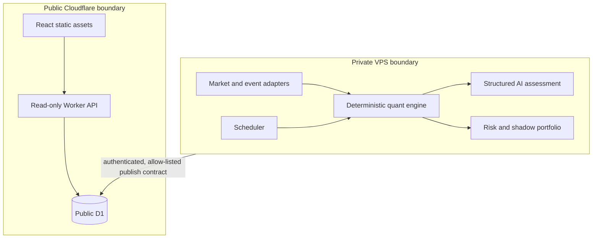

# Architecture

The public side has no mutation, broker, MCP, shell, execution or administrative route. The private side owns market providers, TradingView MCP, Firecrawl, OpenAI, research, backtests, scheduling and simulated execution.

The future VPS publisher sends a sanitised snapshot to a dedicated authenticated Cloudflare ingest boundary. That boundary is intentionally not created as a public route in V5.1; it must be configured after inspecting the existing VPS/Cloudflare integration.

